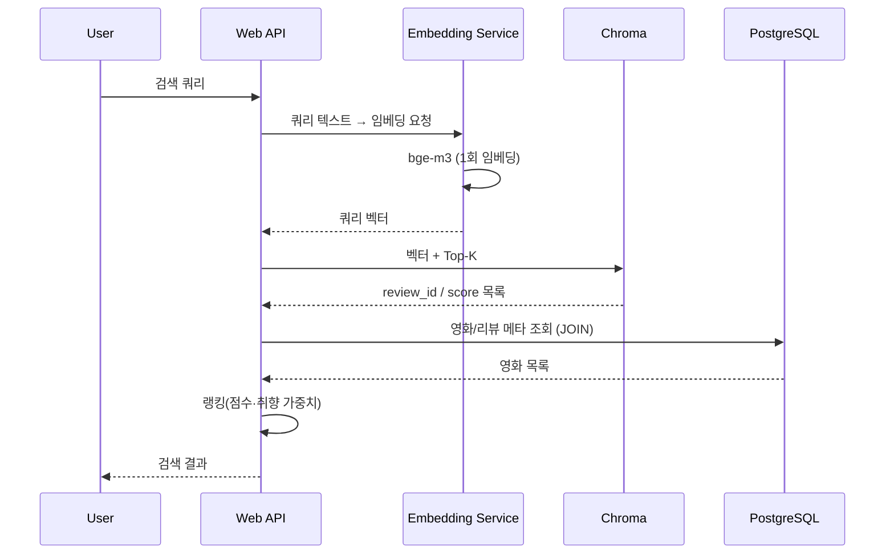
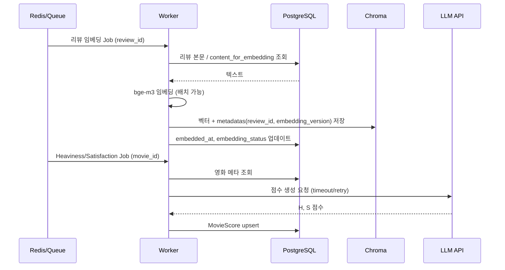

# 아키텍처 피드백 정리

> 다른 AI 모델들이 제시한 아키텍처(온라인/오프라인 분리, Postgres + ChromaDB, 임베딩 재사용)에 대한 검토를 **우선순위·카테고리** 기준으로 정리한 문서입니다. 배포·운영 시 반드시 터지는 지점 위주로 보완 제안을 반영했습니다.

---

## 1. 총평 (공통 인식)

- **온라인은 가볍게** (쿼리 1회 임베딩 + 벡터 Top-K + RDB 조인) / **오프라인은 무겁게** (임베딩 적재·LLM 보강·점수 계산) 구조는 **잘 잡혀 있음**. 서비스 형태로 굴리기에 충분하고 배포 관점도 현실적.
- **PostgreSQL(정형) + ChromaDB(벡터)** 이중 구조는 MVP·초기 스타트업에 적합한 정석적 접근.
- 보완은 **ChromaDB 운영 안정성**, **임베딩 버전/상태 관리**, **모델 상주 위치(메모리)** 세 가지를 우선 확정하면 나머지는 따라오는 수준.

---

## 2. 우선순위별 보완 사항

### 🔴 높음 (운영 전 반드시 결정·구현)

| # | 항목 | 내용 |
|---|------|------|
| 1 | **ChromaDB 운영 모드** | 로컬 디스크 단일 서버 + Embedded 모드는 **내구성·동시성 리스크** 있음. 서버/디스크 장애 시 벡터 통째로 손실, 웹 worker 다수 + 워커가 동시 접근 시 DB Lock 가능. **권장:** 배포 시 **Chroma Server 모드** (Docker `chromadb/chroma` 컨테이너)로 전환. Web/Worker는 HTTP로 접속. 볼륨은 외장/영속 스토리지 + 스냅샷 백업. |
| 2 | **벡터 “재생성 가능” 설계** | Chroma를 **캐시/인덱스**로 취급. 원천은 PostgreSQL에 두어 **깨져도 재적재** 가능하게. Postgres에 `embedding_source_text`, `embedding_version`, `embedded_at`(또는 아래 임베딩 메타 필드) 저장. |
| 3 | **임베딩 모델 상주 위치** | bge-m3를 **웹 worker마다** 로드하면 메모리 6~8GB급 폭증. **권장:** (MVP) 웹 worker 수를 크게 늘리지 않거나, (권장) **임베딩 전용 서비스/워커**로 분리 — 웹 → 임베딩 서비스 HTTP 호출 → Chroma 조회. 모델은 **단 1~2 프로세스**에서만 로드. |
| 4 | **Chroma vs pgvector 선택** | 규모가 크지 않다면 **pgvector**로 Postgres 하나로 통합하면 운영 단순·트랜잭션 일관성 좋음. 수백만 벡터 이상·Python 생태계 연동 중요하면 Chroma 유지. **결정:** MVP는 Chroma OK → “재생성 + 백업” 문서화/코드화 필수. |

---

### 🟠 중간 (안정성·품질)

| # | 항목 | 내용 |
|---|------|------|
| 5 | **임베딩 버전/해시/상태** | “텍스트·전처리·모델 변경” 시 **어떤 것만 재임베딩할지** 제어하려면 Review(또는 Embedding 테이블)에 다음 필드 권장: `content_for_embedding`, `content_hash`(예: sha256), `embedding_model`, `embedding_dim`, `embedding_version`, `embedded_at`, `embedding_status`(PENDING\|DONE\|FAILED), `error_message`(옵션). Chroma 메타데이터에도 `review_id`, `movie_id`, `embedding_version` 등 저장. |
| 6 | **PostgreSQL–Chroma 동기화** | 리뷰 **삭제** 시 Chroma에서 해당 ID 벡터 삭제(트랜잭션 커밋 후 즉시 또는 비동기). **수정** 시 내용 변경이면 기존 벡터 삭제 후 재생성. Chroma 저장 시 `metadatas`에 `review_id`, `movie_id` 등 PK 반드시 포함. |
| 7 | **하이브리드 검색** | 순수 벡터만 쓰면 고유명사(영화 제목, 배우명) 정확도 약함. **PostgreSQL Full-text Search(또는 tsvector)** + Chroma 벡터 검색 결과를 **RRF(Reciprocal Rank Fusion)** 로 합치거나, bge-m3의 sparse+dense 특성 활용. MVP는 벡터만으로 시작, “아이언맨” 검색 품질 문제 나오면 키워드 결합. |
| 8 | **검색 품질 정책** | 한국어/혼합: 쿼리 짧으면 키워드 매칭·정규화 먼저, 시맨틱은 보조. 최종 랭킹은 `vector_score + (인기도/평점/신뢰도/최신성)` 가중치. MovieScore(Heaviness/Satisfaction)와 잘 맞음. |

---

### 🟡 낮음 (운영 안정화 후)

| # | 항목 | 내용 |
|---|------|------|
| 9 | **LLM/워커 설계** | Heaviness·Satisfaction·리뷰 보강은 **비동기 강제**. Job idempotent, LLM 호출에 timeout/retry/rate limit/비용 상한, 결과 캐시(review_id+version), 실패 시 FAILED로 남겨 재처리 가능하게. |
| 10 | **배포 구성 보완** | Compose에: (1) DB 마이그레이션 실행 방식(배포 시 자동/수동 명확화), (2) Postgres + Chroma **백업** 전략, (3) **관측** — 구조화 로그, metrics(요청/임베딩/Chroma 시간), Sentry 등. nginx(HTTPS 종료), `/healthz`, HuggingFace 캐시 볼륨. |
| 11 | **환경·시크릿** | prod에서는 `.env` 직접 배치 대신 **Secret Manager / Parameter Store** 권장. 추가 env 예: `LLM_PROVIDER`, `LLM_MODEL`, `OPENAI_BASE_URL`, `EMBEDDING_BATCH_SIZE`, `TOP_K_DEFAULT`, `CORS_ORIGINS`, `SENTRY_DSN`. |
| 12 | **모델 최적화** | Singleton으로 1회만 로드; 필요 시 **양자화(INT8)**·ONNX/OpenVINO로 CPU 추론·메모리 절감 검토(초기엔 PyTorch 그대로 가능). |

---

## 3. 요청 시퀀스 (참고용)

### 3.1 온라인 검색 요청

### 3.2 오프라인 워커 (리뷰 임베딩·점수)

---

## 4. 결정 체크리스트 (배포 전)

- [ ] Chroma: **Server 모드**(Docker) vs Embedded 확정. Server면 `CHROMA_SERVER_HOST`, `CHROMA_SERVER_PORT` 설정.
- [ ] 벡터 **재생성** 절차 문서화: Postgres 원천 필드 + 스크립트로 Chroma 재적재 가능한지.
- [ ] **임베딩** 수행 주체 확정: 웹 단일 프로세스 vs 전용 임베딩 서비스/워커.
- [ ] Review(또는 Embedding) 테이블에 **embedding_version / content_hash / embedding_status** 등 반영 여부.
- [ ] 리뷰 삭제/수정 시 Chroma **동기화** 로직(삭제·재생성) 구현.
- [ ] 배포 시 **마이그레이션·백업·헬스체크·시크릿** 위치 정리.

이 문서는 `docs/` 에서 ERD, DATASET과 함께 배포·운영 설계 시 참고용으로 사용하면 됩니다.
